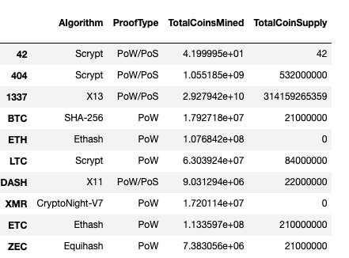
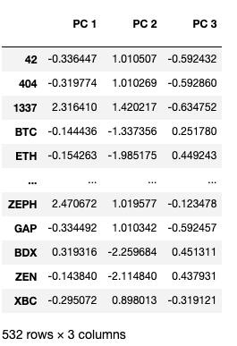
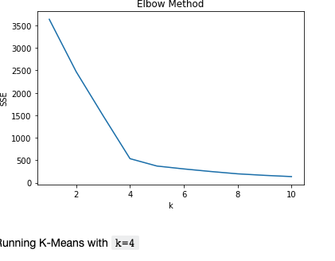
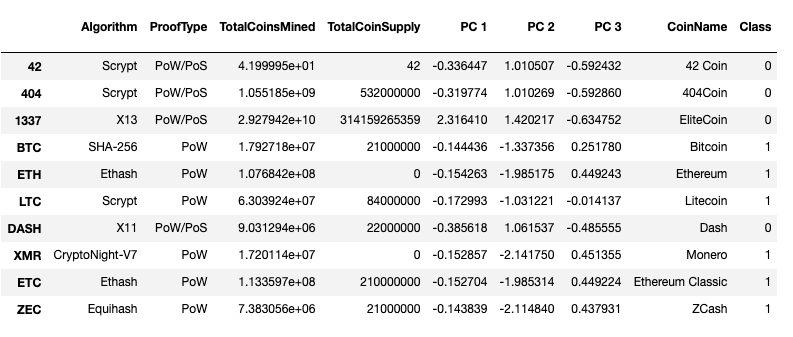
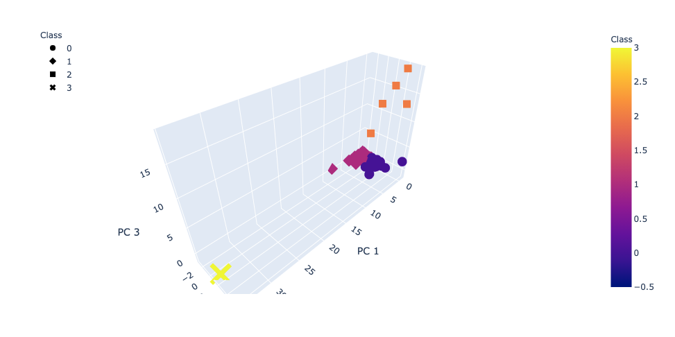
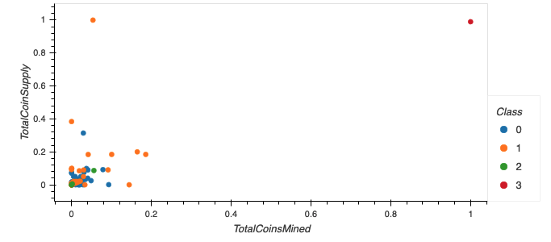

# Cryptocurrencies

## Overview of the analysis

The purpose of this analysis are :

* To determine what cryptocurrencies are on the trading market.
* To determine the way to group and classify them using clustering algorithm.
* To use unsupervised learning for the analysis.
* To use visualizations to report the findings.

## Results

### Principal Component Analysis (PCA)

PCA is a statistical technique to speed up machine learning algorithms when the number of input features (or dimensions) is too high. PCA reduces the number of dimensions by transforming a large set of variables into a smaller one that contains most of the information in the original large set.

### Preprocessing the Data for PCA

Data preprocessing in Machine Learning refers to the technique of preparing (cleaning and organizing) the raw data to make it suitable for a building and training Machine Learning models.

The provided data in this challenege is preprocessed by :
* keeping only the cryptocurrencies that are traded.
* removing the rows that has al teast one null value.
* Keeping all the cryptocurrencies that have a working algorithm.
* Keeping all the rows where coins are mined.
* Use get_dummies() to create variables for text features.

The newly created dataframe with preprocessed data are then standardized using StandardScaler()

### Reducing Data Dimensions Using PCA

Using the Principal Component Analysis (PCA) algorithm, the dimensions of the X DataFrame, are reduced to three principal components and these dimensions are placed in a new DataFrame.

### Clustering Cryptocurrencies Using K-means

Using K-means algorithm, and using an elbow curve is created to find the best value for K from the last dataframe created.
K-means algorithm are executed to predict the K clusters for the cryptocurrencies’ data.

### Visualizing Cryptocurrencies Results

Scatter plot and 3D scatter plot are created with Plotly Express and hvplot to visualize the distinct groups.

## Summary

